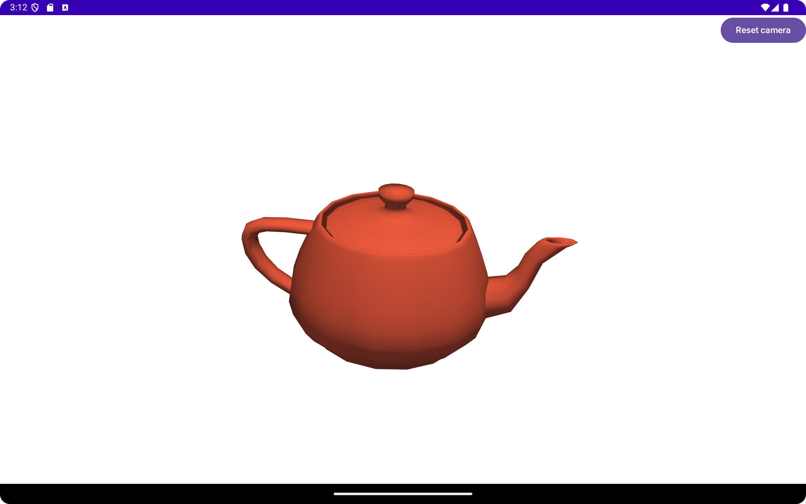

## VTK Android Sample Application with Kotlin/C++

The C++ sources are in https://github.com/jspanchu/vtkAndroidViewer/tree/main/app/src/main/cpp.
The Kotlin user interface and activity code is in https://github.com/jspanchu/vtkAndroidViewer/tree/main/app/src/main/java/com/kitware/vtkviewer

The sample application renders a teapot mesh. Here's a screenshot of the button on top and a VTK render window.

